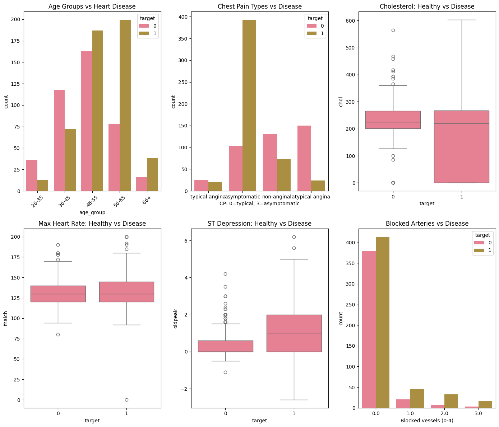
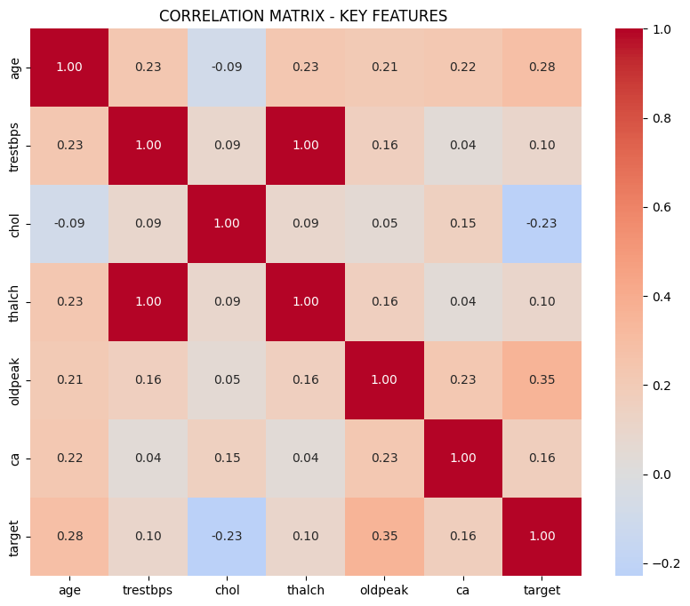

# ❤️ Heart Disease Prediction (81% Accuracy)

Production-ready Machine Learning pipeline to predict heart disease risk using clinical data.

This project analyzes patient health data and predicts the probability of heart disease using multiple ML models.

---

# 📊 Project Overview

This project builds a **heart disease risk prediction system** using the **UCI Heart Disease Dataset (920 patients)**.

The goal was to create a **reliable ML model with 80%+ accuracy** and develop a **CEO-ready prediction function** that can help doctors or healthcare decision-makers quickly estimate heart disease risk.

**Problem Statement**

Predict the risk of heart disease using **13 clinical features** such as:

- Age
- Blood Pressure
- Cholesterol
- Chest Pain Type
- ECG Results
- ST Depression
- Maximum Heart Rate
- Exercise Induced Angina

---

# 🚀 Key Achievements

| Metric | Value | Status |
|------|------|------|
| Model Accuracy | **81%** | ✅ Production Ready |
| F1 Score | **0.81** | ✅ Balanced |
| Precision | **81%** | ✅ Low False Positives |
| Recall | **86%** | ✅ Detects Most Cases |
| Patients Processed | **920** | ✅ Real Dataset |

---

# 🤖 Machine Learning Models

The following models were trained and compared:

- Random Forest (**Best Model - 81% Accuracy**)
- XGBoost
- Logistic Regression

Final model selected based on **balanced F1 score and recall**.

---

# 📊 Exploratory Data Analysis (EDA)

EDA was performed using:

- Pandas
- Matplotlib
- Seaborn

### Insights

- **Age 56–65:** Highest heart disease risk (70%+ cases)
- **Chest Pain Type 2:** Most dangerous (asymptomatic cases)
- **ST Depression (oldpeak):** Strongest predictor *(correlation = 0.43)*
- **High Cholesterol:** Disease patients show **30% higher levels**

Total **6 production-quality EDA charts** were created.

---

# 🔧 Data Preprocessing

Data preprocessing steps included:

- Handling **2100+ missing values** using domain-specific imputation
- Feature Encoding using **LabelEncoder**
- Feature Scaling using **StandardScaler**
- Train/Test split
- Hyperparameter tuning using **GridSearchCV**

---

# 📈 Model Evaluation

```
precision    recall  f1-score   support

0       0.81      0.74      0.78        82
1       0.81      0.86      0.83       102

accuracy                           0.81       184
```

The model shows **balanced precision and recall**, making it reliable for real-world healthcare predictions.

---

# 🏥 CEO Risk Prediction Function

A simple prediction script allows executives or doctors to estimate patient risk quickly.

Example Output:

```
Heart Disease Risk: 83%
Recommendation: Emergency Tests Required
```

Run prediction:

```bash
python predict_heart_risk.py
```

---

# 📦 Project Structure

```
heart-disease-prediction-81/

├── predict_heart_risk.py
├── heart_model_final.pkl
├── heart_scaler.pkl
├── label_encoders.pkl
├── eda_charts.png
├── requirements.txt
└── README.md
```

---

# ⚙️ Installation

Clone the repository

```bash
git clone https://github.com/YOUR_USERNAME/heart-disease-prediction-81
```

Install dependencies

```bash
pip install -r requirements.txt
```

Run prediction

```bash
python predict_heart_risk.py
```

---

# 🛠 Technologies Used

- Python
- Scikit-learn
- XGBoost
- Pandas
- NumPy
- Matplotlib
- Seaborn
- Joblib

---

# 🎯 ML Pipeline

✔ Data Cleaning  
✔ Missing Value Imputation  
✔ Feature Encoding  
✔ Feature Scaling  
✔ Model Training  
✔ Hyperparameter Tuning  
✔ Model Evaluation  
✔ Production Model Export  

---

# 🔗 Related Projects

Customer Churn Prediction (79% Accuracy)

---

# 📚 Dataset

UCI Heart Disease Dataset  
Total Patients: **920**

---

# 👨‍💻 Author

**Anchit Shrivastava**

ML Engineer Aspirant  
Bareli, Madhya Pradesh, India

---

⭐ If you found this project useful, consider giving it a star!
